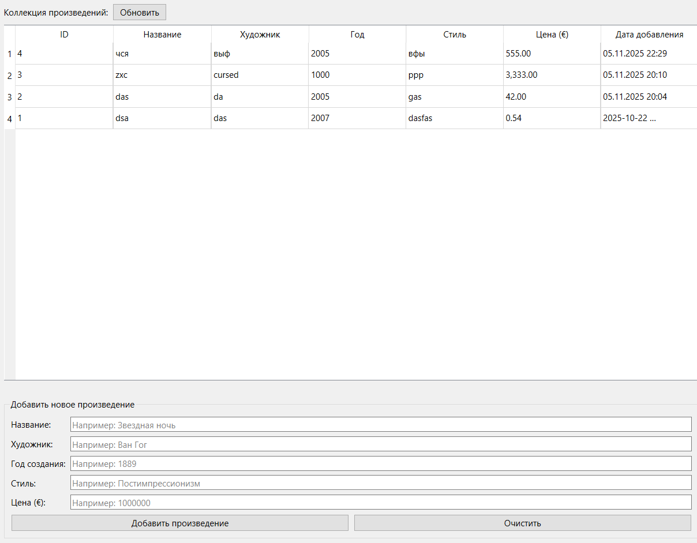

# Виртуальная галерея

Реализовано приложение с GUI для работы с БД.

## Запуск

Перед запуском пропишите для установки библиотек
` pip install -r requirements.txt `

После установки библиотек, чтобы запустить приложение необходимо прописать
` python main.py `

## Интерфейс

## Тесты

Для запуска тестов пишите
` python -m pytest `